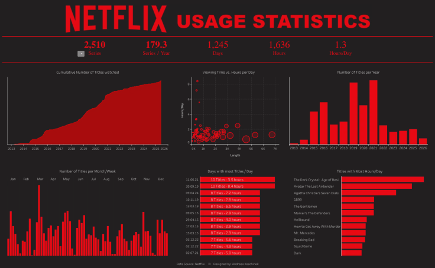

# Netflix-Tableau

## Project Overview
This project analyzes Netflix content using Tableau. The dashboard provides insights into movies and TV shows available on Netflix, helping users understand content distribution, ratings, genres, countries, and release trends.

## Objectives
- Analyze Netflix Movies and TV Shows.
- Identify the most popular genres.
- Explore content distribution by country.
- Compare Movies vs TV Shows.
- Analyze content release trends over the years.

## Tools Used
- Tableau
- Microsoft Excel / CSV
- Data Cleaning

## Dataset
The dataset contains Netflix titles information including:
- Title
- Type (Movie/TV Show)
- Genre
- Country
- Release Year
- Rating
- Duration

## Dashboard Insights
- Total Movies and TV Shows
- Content by Rating
- Content by Country
- Top Genres
- Release Year Trends
- Movies vs TV Shows Comparison

## Dashboard Preview

## Key Findings
- Movies make up the majority of Netflix content.
- Drama and Comedy are among the most popular genres.
- The United States contributes the highest number of titles.
- Netflix content has grown significantly in recent years.

## Author
Rahul Chauhan
